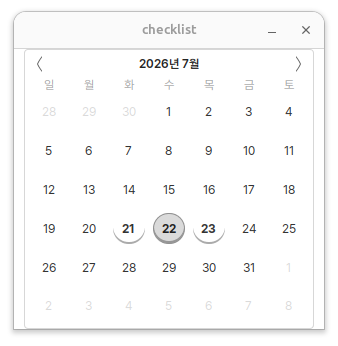
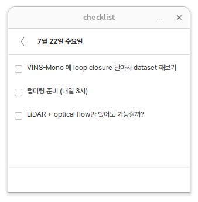

# checklist

<p align="center">
  
  
</p>

날짜별 할 일을 기록하는 작은 Linux GTK 체크리스트 앱입니다.

## 기능

- 날짜별 체크리스트와 SQLite 자동 저장
- 완료 표시, 여러 줄 작성, 내용 수정
- 우클릭으로 내일 이월 또는 삭제
- 가운데 버튼 드래그로 순서 변경
- 실행 취소·다시 실행과 잘라내기·복사·붙여넣기
- 마지막 창 위치 복원, Pretendard 10pt 적용

## 설치

Ubuntu/Debian:

```bash
sudo apt install git python3 python3-gi gir1.2-gtk-3.0
git clone https://github.com/kimyina/checklist.git
cd checklist
./install.sh
```

설치 후 앱 메뉴에서 `checklist`를 검색하거나 터미널에서 실행합니다.

```bash
checklist
```

## 사용

- 날짜 클릭: 체크리스트 열기
- 항목 클릭: 수정
- `Enter`: 새 항목 추가
- `Shift+Enter`: 항목 안에서 줄바꿈
- 항목 우클릭: 내일로 이월 또는 삭제
- 가운데 버튼 드래그: 순서 변경
- `Esc`: 달력으로 돌아가기

## 제거

```bash
./uninstall.sh
```

체크리스트 데이터는 삭제되지 않으며 다음 위치에 보존됩니다.

```text
~/.local/share/daily-checklist/checklist.db
```

`XDG_DATA_HOME`을 사용 중이면 해당 경로 아래에 저장됩니다.

## 글꼴

[Pretendard v1.3.9](https://github.com/orioncactus/pretendard) Regular를 앱 전용으로
포함합니다. 라이선스는 `assets/fonts/LICENSE.txt`에서 확인할 수 있습니다.
